# Exercise 2 - Create a UI Integration Card in Business Application Studio

We have now the standardized API (Curl) through Open Connectors, that we need to connect towards our Google Drive.

Now lets create the actual UI Integration Card where we fill in the information that we generated through our get request above.

## Create new Development Space

(1) Switch back to our **SAP BTP cockpit** and go to the **Business Application Studio**.

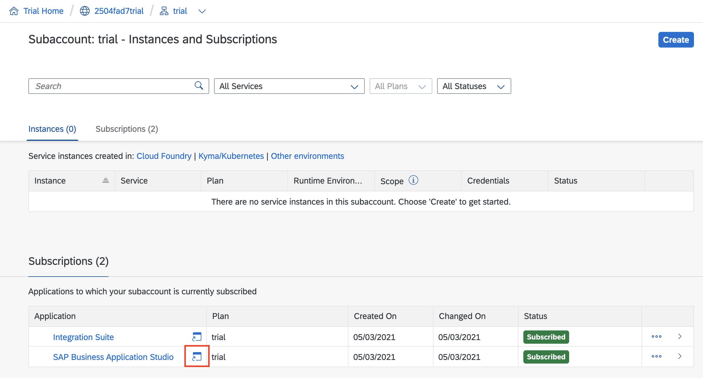

(2) Create a new **Dev Space** where you can develop various kind of applications.

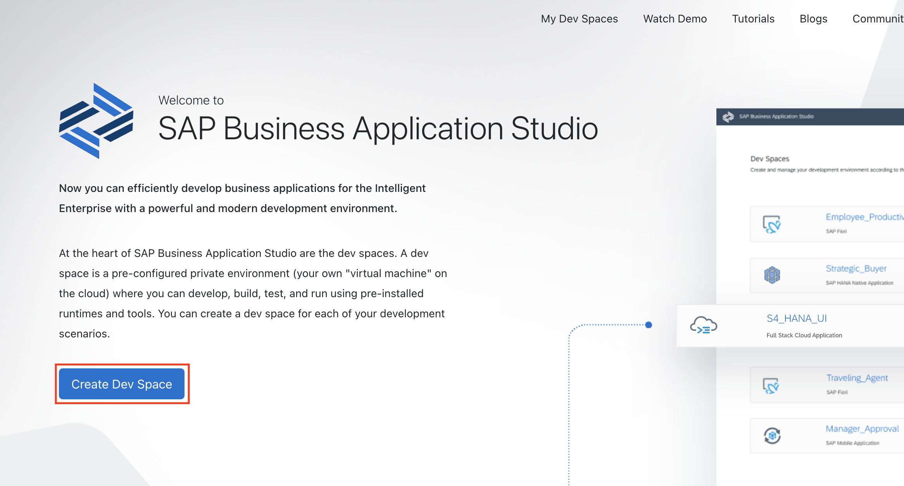

(3) Insert a **name** for the Dev Space, make sure to choose a **SAP Fiori space** and choose the extensions for **SAP Work Zone** where you can benefit from several templates of UI Integration Cards.

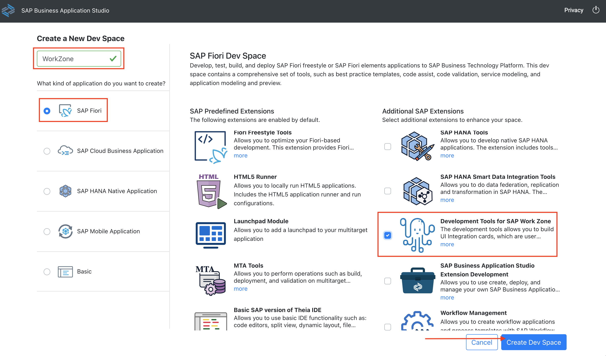

(4) When your Dev Space is **RUNNING**, open it.

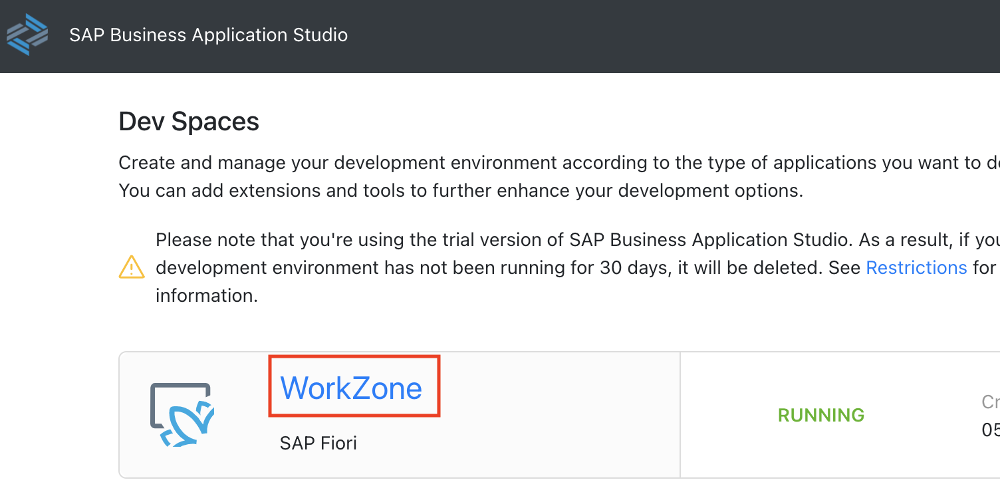

## Run Wizard to Generate SAP UI Integration Card

(5) Choose **Start from Template**

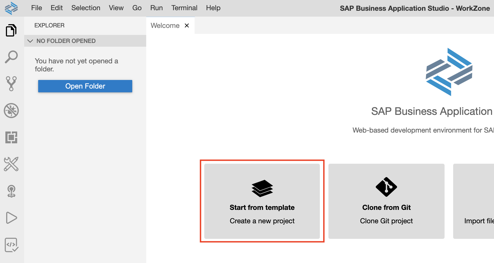

(6) Scroll down and select the template for **UI Integration Cards** and click on **Start**.

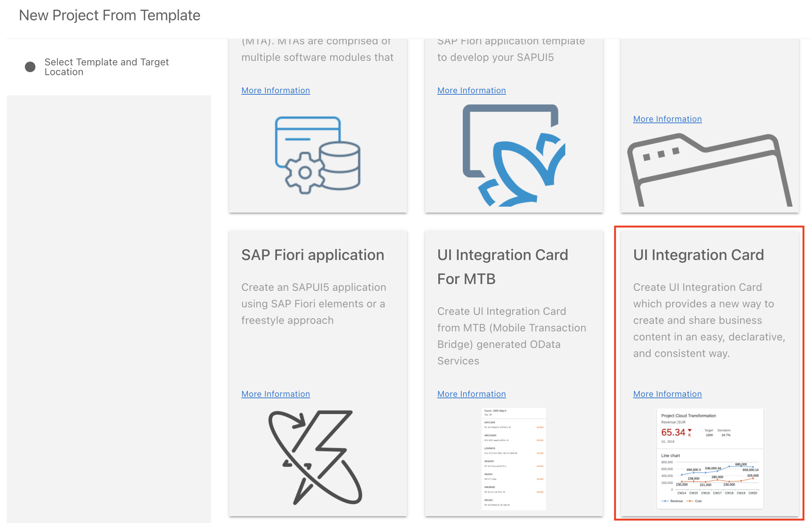

(7) Insert the _Project Name_, _Namspace_, _Card Sample_ **Highlight Card**, and a _Title_. Leave _Compatible with SAP Mobile Cards_ to false and click on **Finish**.

> Note that your workspace will reload with the newly generated project.

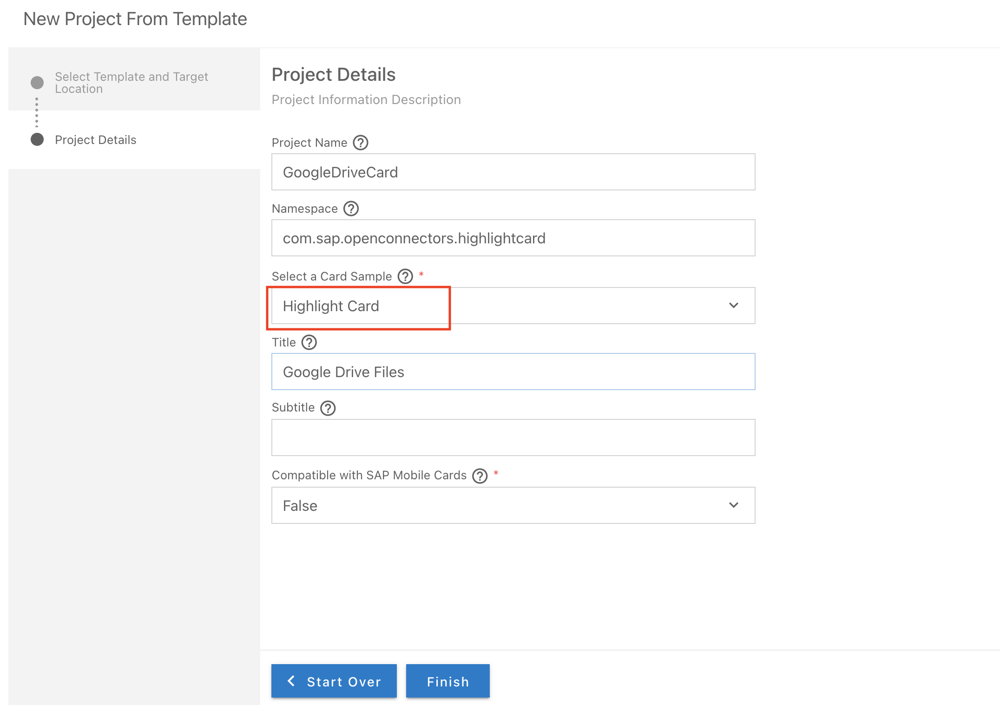

(8) Right click on file **manifest.json** and choose **UI Integration Card: Preview**. This will give you a live preview.
(9) Right click on file **manifest.json** and choose **UI Integration Card: Edit**. This will give you the options to change the manifest in a no-code way.

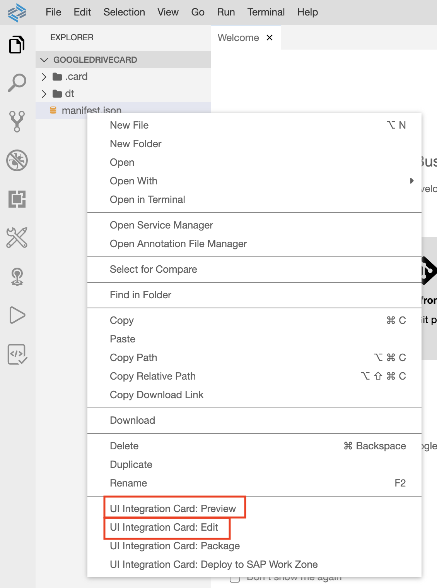

## Change the content of the UI Integration Card

(10) Delete the preconfigured **JSON Data** from **Data Configuration (Content)** and save the template.

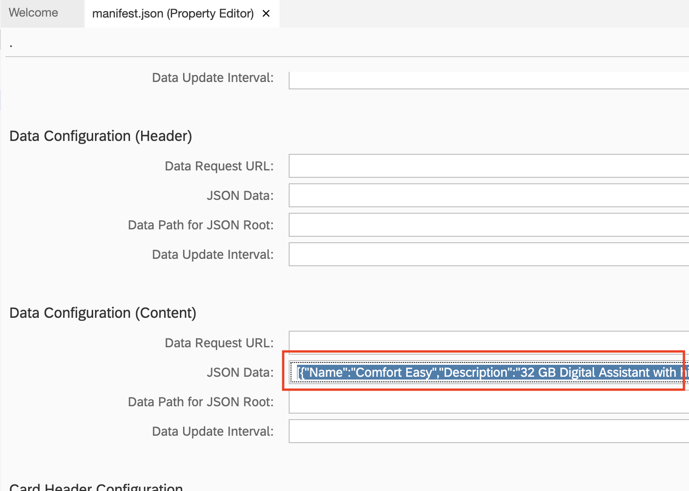

(11) Copy the generated **Request URL** from OpenConnectors and past it in **Data Request URL** under **Data Configuration (Header)**.

> Note that after each save, the preview will reload. You will see an error message **unauthorized** in the right bottom corner.

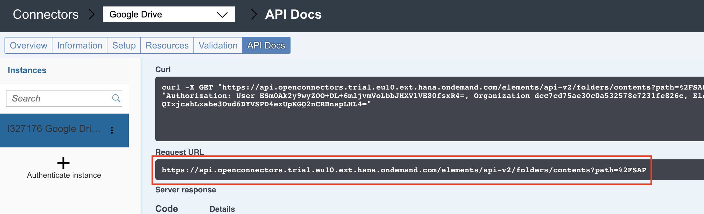
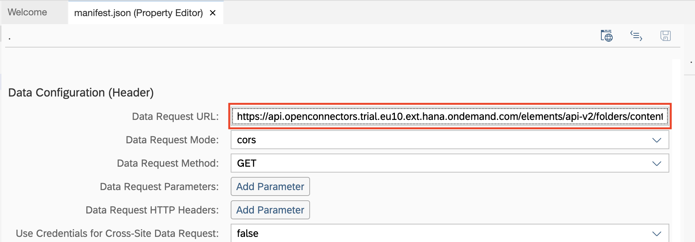

(12) Take over the **headers** from the CURL request. Note that there are 2: **accept** and **Authorization**.

> Note that for Authorization you have to take the full path including user, organization, element.

> Note when copying, don't copy the quotes.

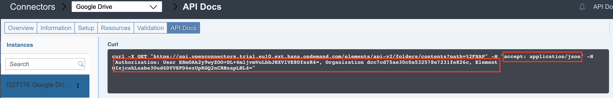

(13) Under **Data Configuration (Content)** add two headers **Data Request HTTP Headers**.

(14) Click **Add Parameter** and add the **key** _accept_ and **value** _application/json_.

(15) Click **Add Parameter** and add the **key** _Authorization_ and **value** like in Open Connectors.

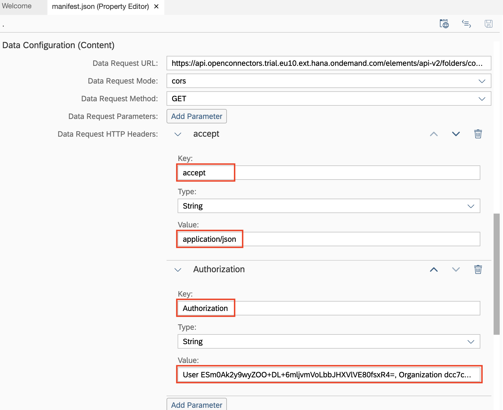

The connection between Google Drive and the UI Integration Card is established.    
Now lets tell the Card what kind of metadata should be shown.    
For this go back into the response header of your GET request and take the metadata that you want to show.

(16) Select **name** and **properties/mimeType**.

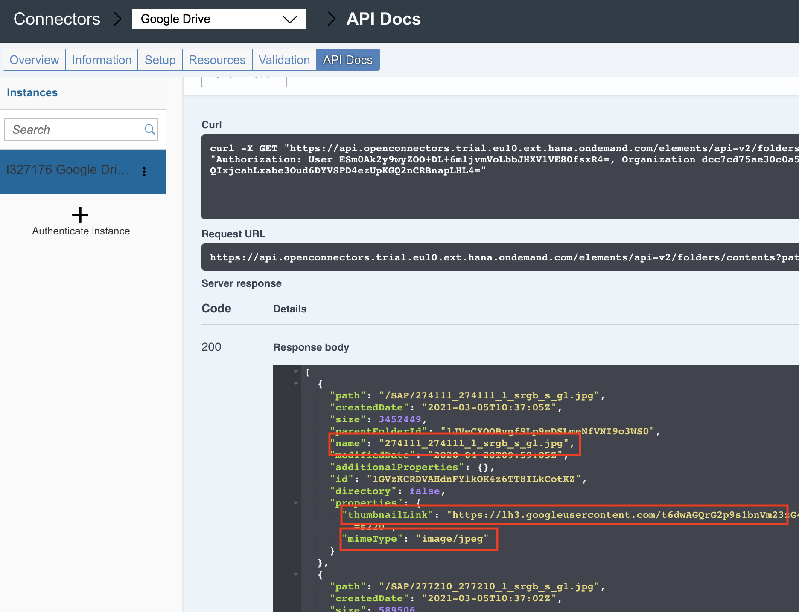

(17) Fill in the name and mimeType in the content configuration section. In addition adjust the card header and give a title as well as subtitle. You should be able to see now in the preview your files of Google Drive from the specific folder “SAP”:

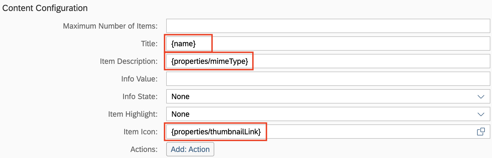

(18) Make the Card Header a bit more clean by changing the field in **Card Header Configuration**.
    Try out the connection and add a file within your Google Drive:

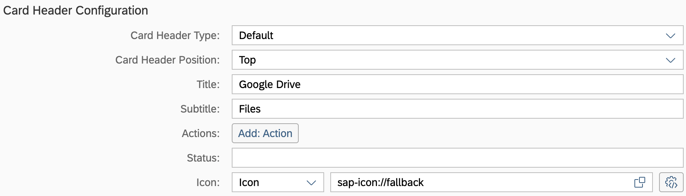

If you were successful the card will be updated accordingly.

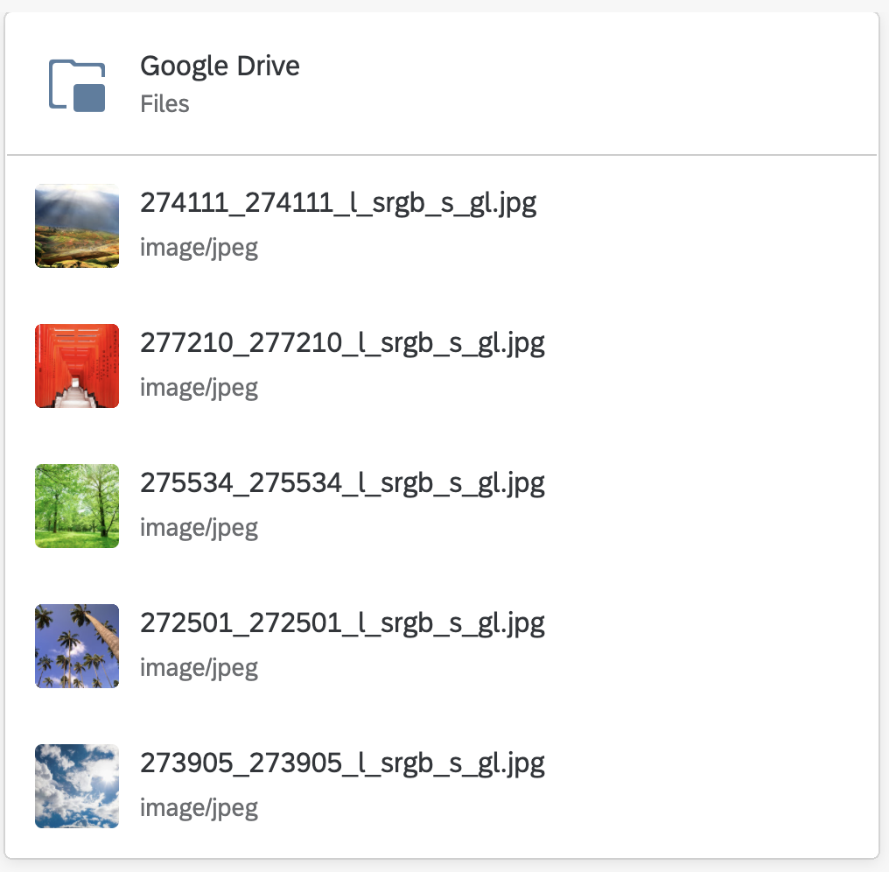

## Summary

Congratulations: you just created a live connection towards your Google Drive account by using Open Connectors and Business Application Studio.   
Feel free to try out with other connectors like ServiceNow as well. For more information see the blogpost by Desiree Moeller:   
[Connect SAP Work Zone to ServiceNow - Part 1](https://blogs.sap.com/2020/12/21/how-to-integrate-3rd-party-services-as-servicenow-to-sap-work-zone-for-hr-using-open-connectors-and-business-application-studio-part-1-2/)
[Connect SAP Work Zone to ServiceNow - Part 2](https://blogs.sap.com/2020/12/22/how-to-integrate-3rd-party-services-as-servicenow-to-sap-work-zone-for-hr-using-open-connectors-and-business-application-studio-part-2-2/)

[Continue to Exercise 3](/Exercises/Exercise3/readme.md)    

[Go back to Exercise overview](/readme.md)
