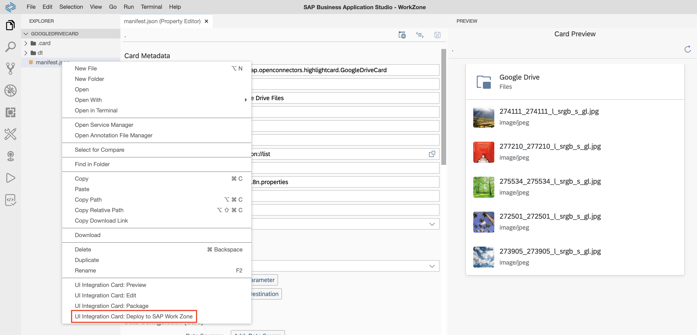
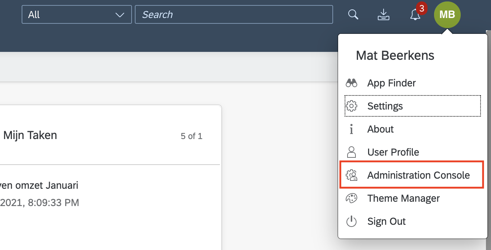
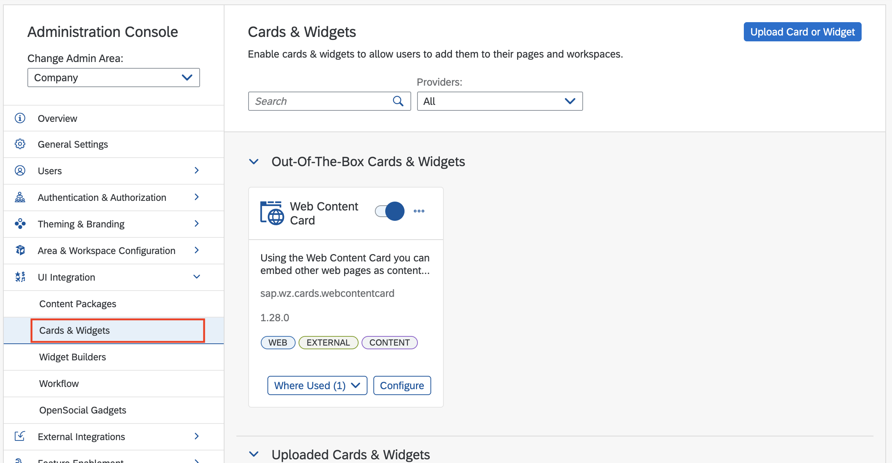
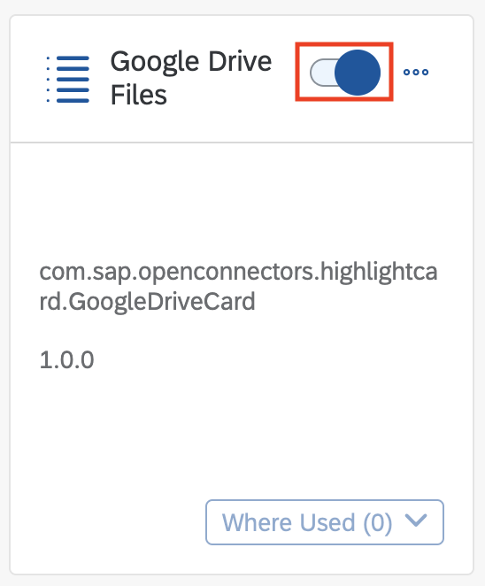
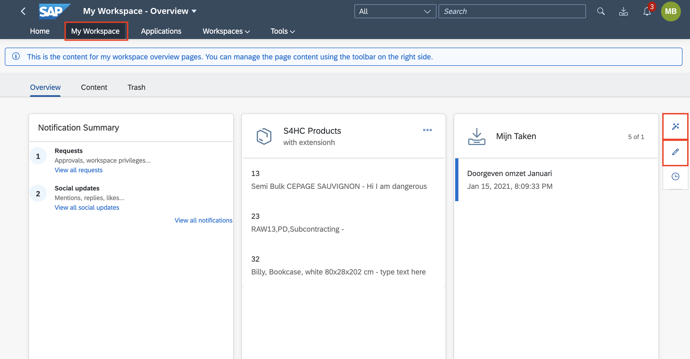
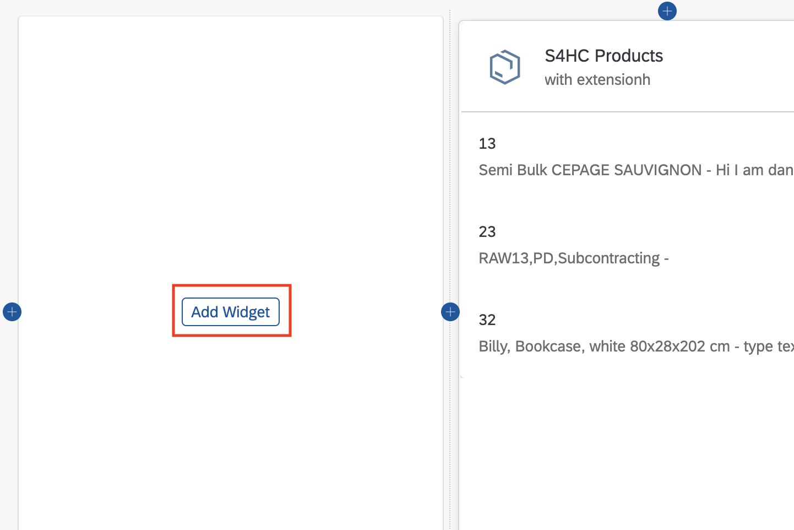
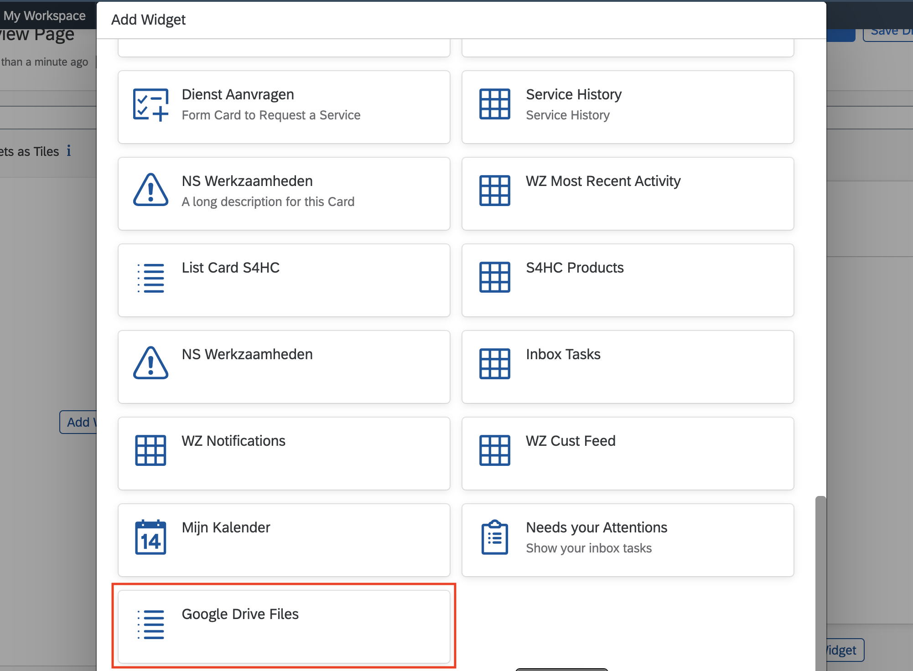
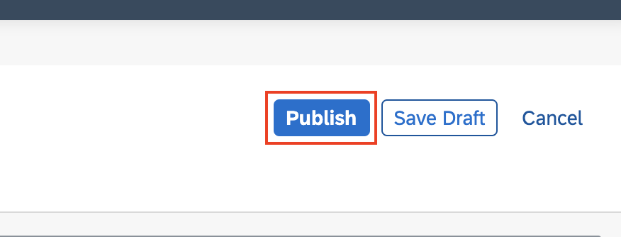
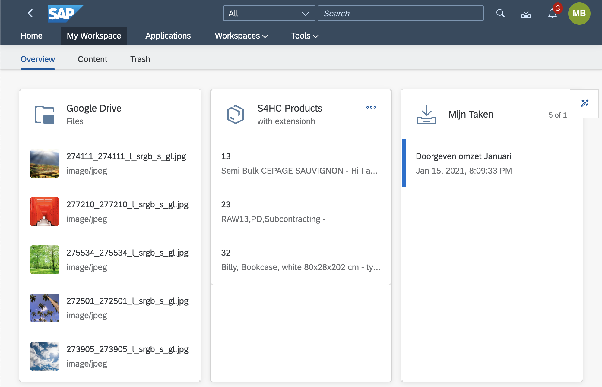

# Exercise 3 - Deploying/consuming the Card in SAP Work Zone

> Note that this exercise cannot be performed on a trial account yet.
> Hence this exercise is for reference only and cannot be performed unless you have a private deployment.   
>  `During the Workshop, we will show what deployment looks like.`   
> If you want to try it out on your own please contact [desiree.moeller@sap.com](mailto://desiree.moeller@sap.com).

(1) In the **SAP Business Application Studio** right click on _manifest.json_ and choose **UI Integration Card: Deploy to SAP Work Zone**.

(2) Switch back to **SAP Work Zone**, and click on your initials and choose **Administration Console**.

(3) In the left menu, select **UI integration** and next **Cards & Widgets**.

(4) Search for your card that you just deployed and **activate** by clicking the switch icon on the card.

(5) Go back to **My Workspace** and click on the **wizard** icon on the right. Next click on the **edit** icon right below it.

(6) Add a widget by clicking on the **Add widget** button.

(7) Search for your card and click on it.

(8) Your card has now be added to the page. Finish your work by clicking **Publish**.

(9) :tada: You may pat yourself on the back. You just built and deployed a **SAP UI Integration Card** without using any code. :partying_face:

:vulcan_salute: Live long and prosper.

---
[Go back to Exercise overview](/readme.md)
